# Dự án bộ thẻ Anki cơ bản cho các ngôn ngữ khác

Dự án làm các bộ thẻ học từ vựng cơ bản (Từ 1000 đến 1500 từ vựng phổ thông) cho Anki. Bao gồm các ngôn ngữ: Tiếng Đức, Tiếng Pháp, Tiếng Tây Ban Nha, Tiếng Bồ Đào Nha, Tiếng Nga, Tiếng Ý, Tiếng Thái, Tiếng Ả Rập (Với Tiếng Thái và Tiếng Ả Rập là 500 từ).

## Tiếng Nga

Bộ thẻ Anki: [Ngaa1.5K - 1500 từ vựng tiếng Nga cơ bản](https://ankiweb.net/shared/info/1818350083) - Đọc [Hướng dẫn tự học Tiếng Nga - Khu học mở](https://daihocmo.github.io/tieng-nga/) để học cách sử dụng bộ thẻ từ vựng.

*mặt trước*:

*mặt sau*:

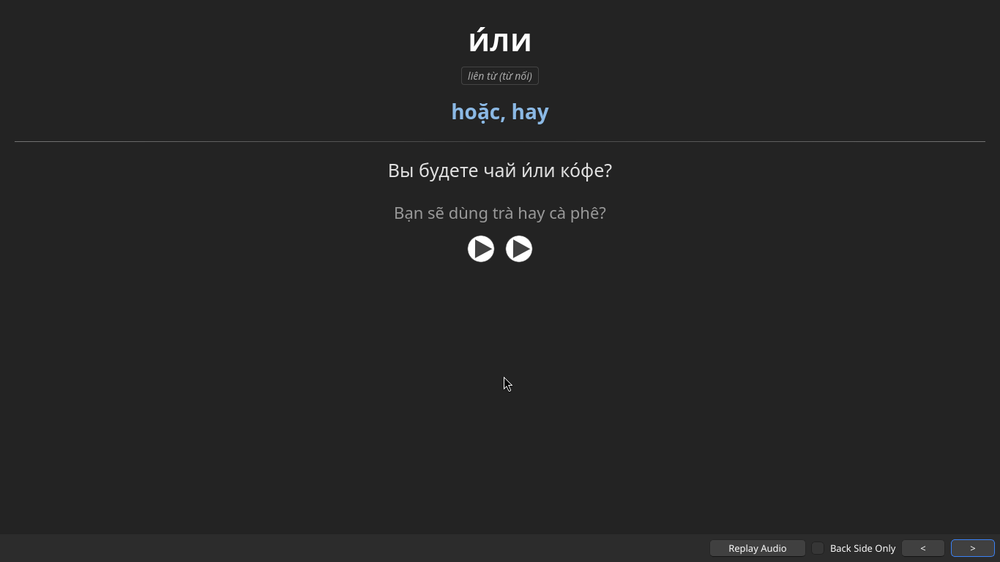

## Tiếng Đức

Bộ thẻ Anki: [Đức1K - 1000 từ vựng tiếng Đức cơ bản](https://ankiweb.net/shared/info/1318915873) - Đọc [Hướng dẫn tự học Tiếng Đức - Khu học mở](https://daihocmo.github.io/tieng-duc/) để học cách sử dụng bộ thẻ từ vựng.

*mặt trước*:

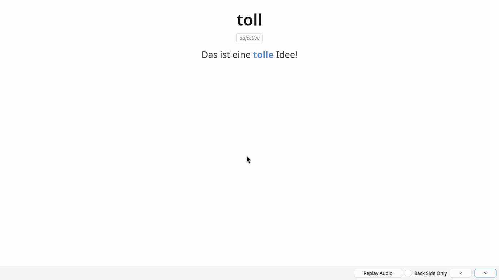

*mặt sau*:

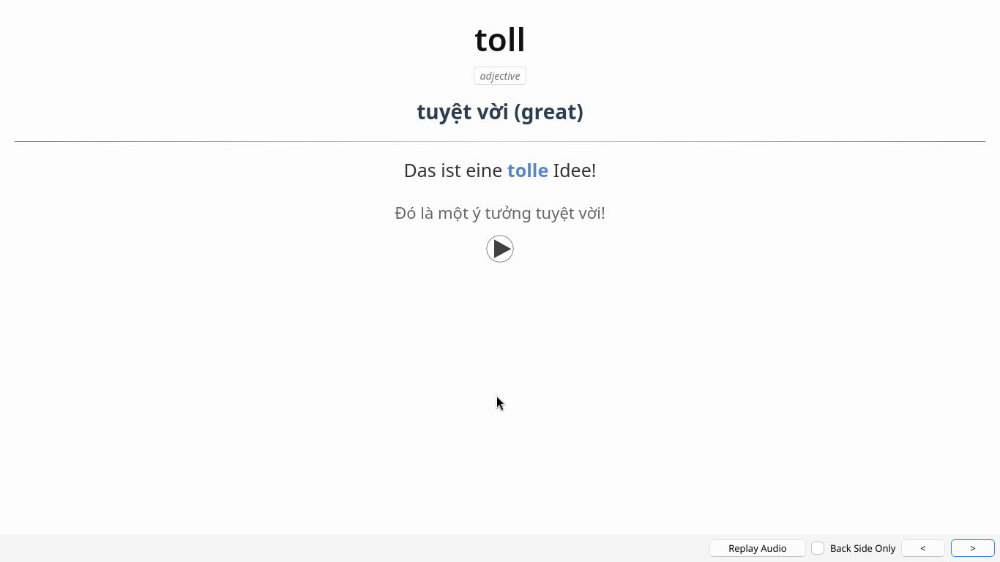

## Tiếng Pháp

Bộ thẻ Anki: [Pháp1K - 1000 từ vựng Tiếng Pháp cơ bản](https://ankiweb.net/shared/info/70809905) - Đọc [Hướng dẫn tự học Tiếng Pháp - Khu học mở](https://daihocmo.github.io/tieng-phap/) để học cách sử dụng bộ thẻ từ vựng.

*mặt trước*:

*mặt sau*:

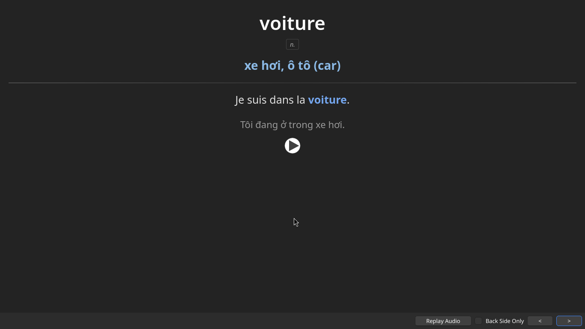

## Tiếng Tây Ban Nha

Bộ thẻ Anki: [TBN1K - 1000 từ vựng tiếng Tây Ban Nha cơ bản](https://ankiweb.net/shared/info/1423899632) - Đọc [Hướng dẫn tự học Tiếng Tây Ban Nha - Khu học mở](https://daihocmo.github.io/tieng-tbn/) để học cách sử dụng bộ thẻ từ vựng.

*mặt trước*:

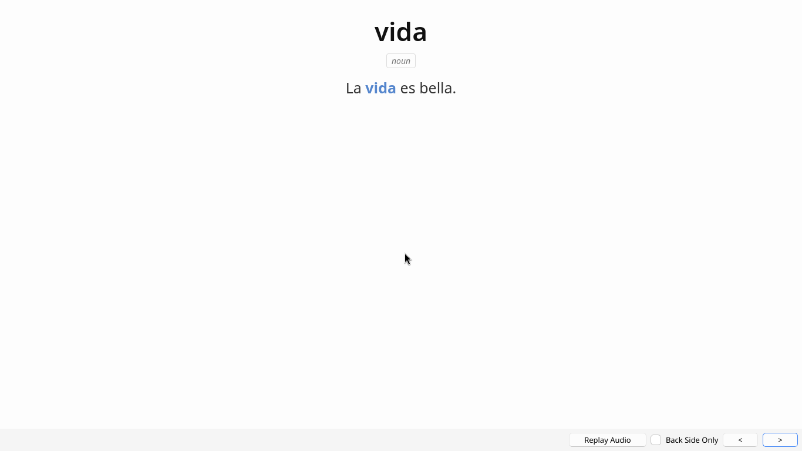

*mặt sau*:

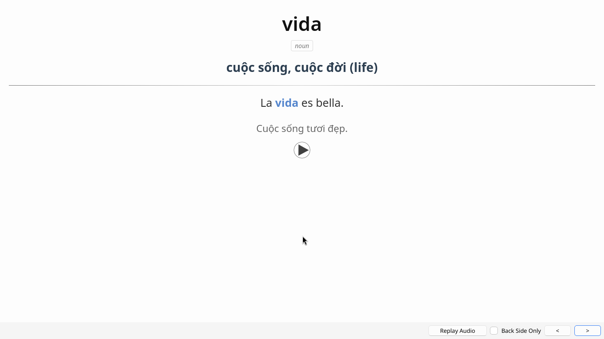

## Tiếng Bồ Đào Nha

Bộ thẻ Anki: [BDN1K - 1000 từ vựng tiếng Bồ Đào Nha cơ bản](https://ankiweb.net/shared/info/1692679380) - Đọc [Hướng dẫn tự học Tiếng Bồ Đào Nha - Khu học mở](https://daihocmo.github.io/tieng-bdn/) để học cách sử dụng bộ thẻ từ vựng.

*mặt trước*:

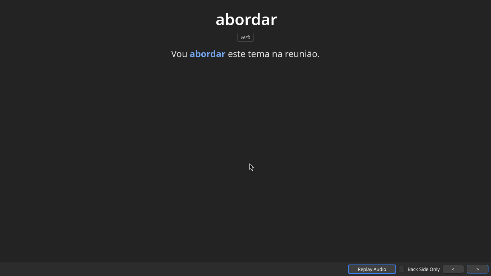

*mặt sau*:

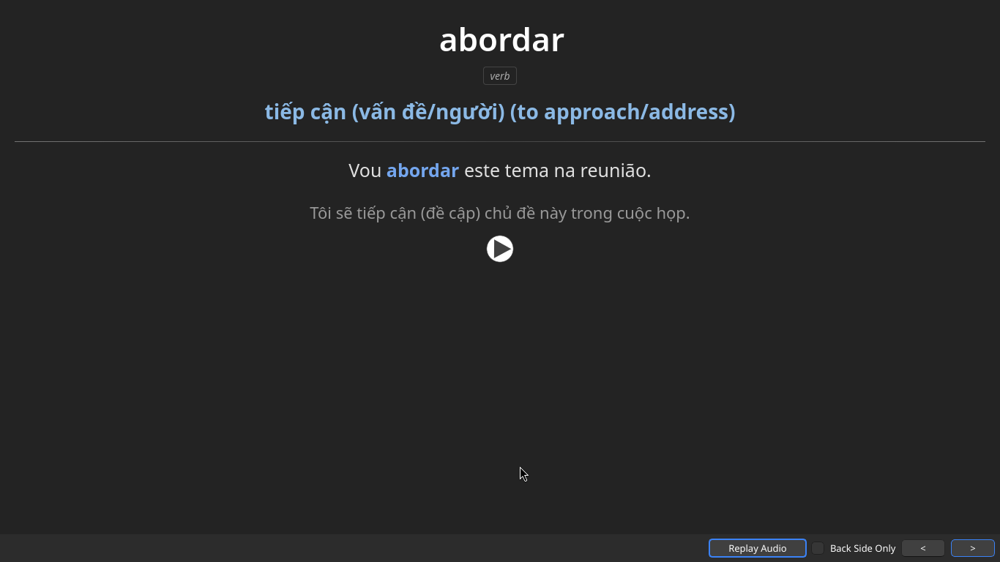

## Tiếng Ý

Bộ thẻ Anki: [ITA1K - 1000 từ vựng Tiếng Ý cơ bản](https://ankiweb.net/shared/info/81140320) - Đọc [Hướng dẫn tự học Tiếng Ý - Khu học mở](https://daihocmo.github.io/tieng-y/) để học cách sử dụng bộ thẻ từ vựng.

*mặt trước*:

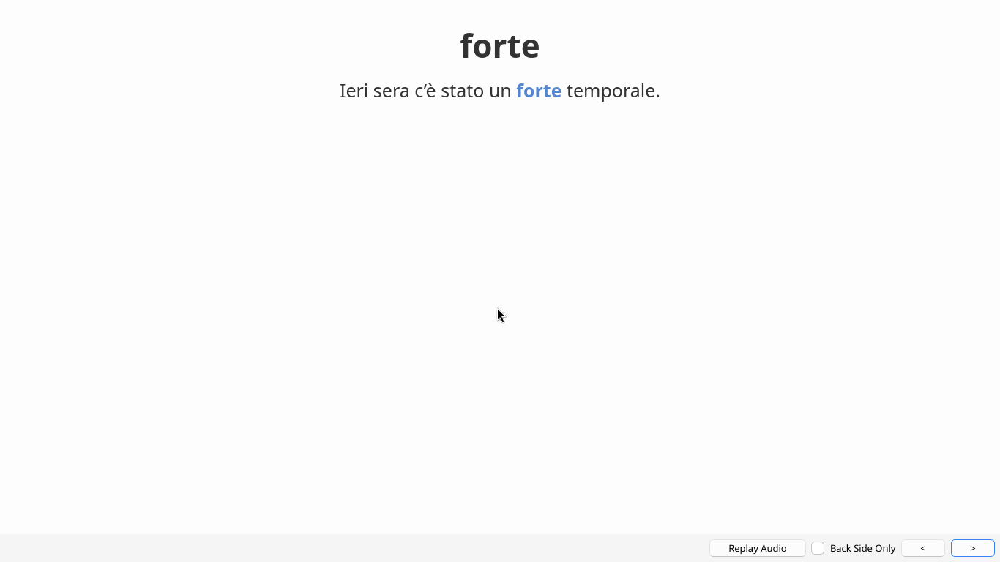

*mặt sau*:

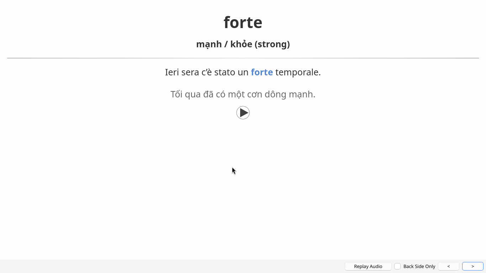

## Tiếng Ả Rập

Bộ thẻ Anki: [Arap0.5K - 500 từ vựng tiếng Ả Rập cơ bản](https://ankiweb.net/shared/info/1608521724) - Đọc [Hướng dẫn tự học Tiếng Ả Rập - Khu học mở](https://daihocmo.github.io/tieng-a-rap/) để học cách sử dụng bộ thẻ từ vựng.

*mặt trước*:

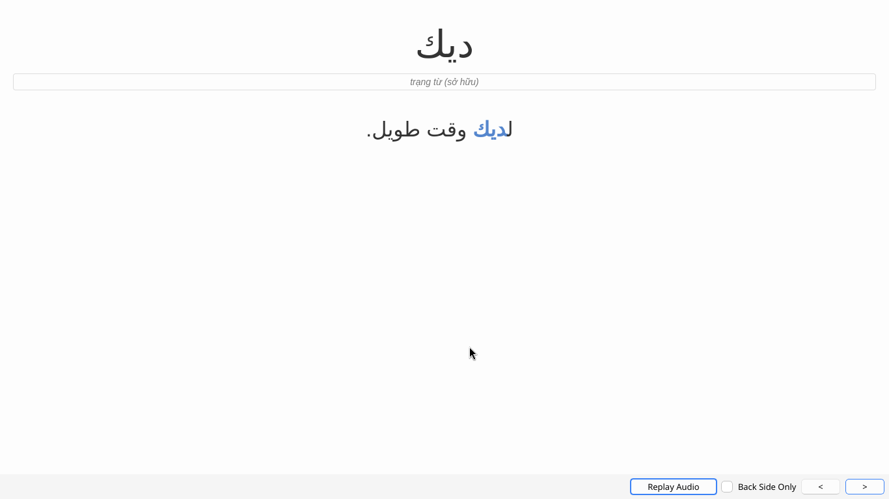

*mặt sau*:

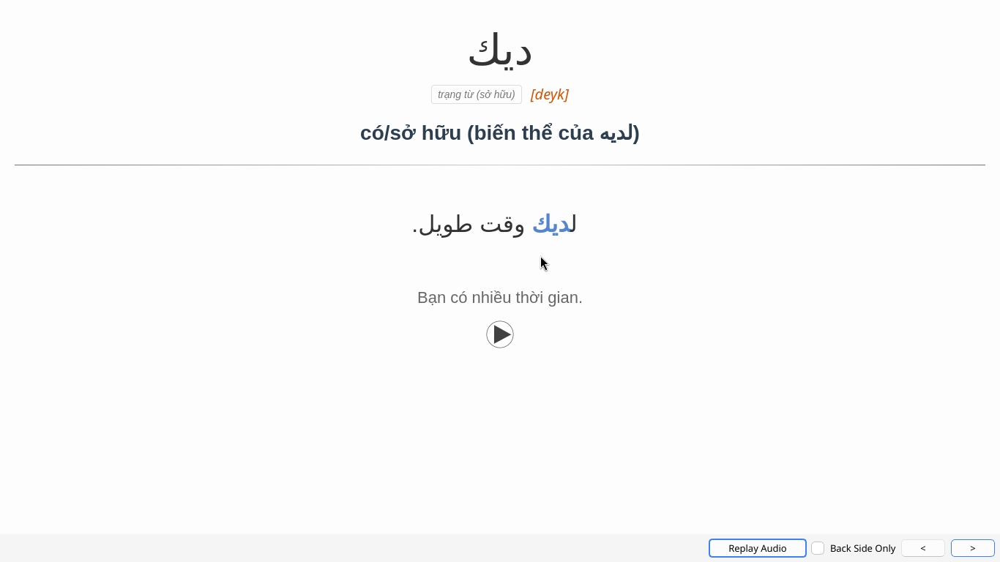

## Tiếng Thái: 

Bộ thẻ Anki: [Pocket Thái v2](https://drive.google.com/file/d/1DLs_lPyoo8KGzusRH1Ew30YUCX_5TkEl/view?usp=drive_link) - Đọc [Hướng dẫn tự học Tiếng Thái - Khu học mở](https://daihocmo.github.io/tieng-thai/) để học cách sử dụng bộ thẻ từ vựng.

*mặt trước*:

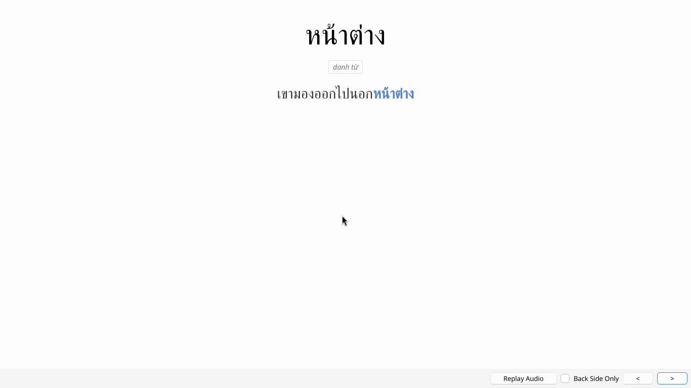

*mặt sau*:

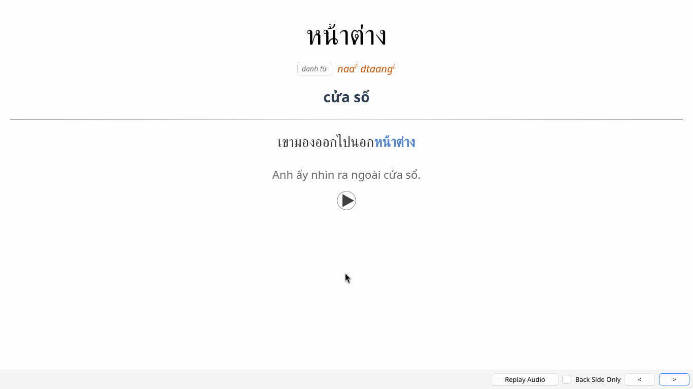